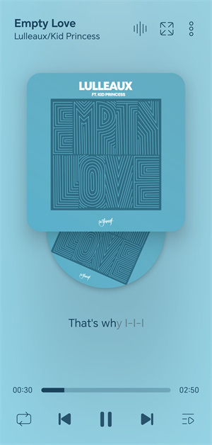

### `Language` &nbsp; [中文](https://github.com/xtdf/LeapMusic/blob/main/README.zh.md)

# Introduction
LeapMusic is a beautiful local music player that supports 38 languages worldwide.
#### `Free and Ad-Free` `Sleek and Lightweight` `Smooth Experience` `Powerful Features`

# Preview
\
Supports `tablet devices`, and available in `dark/light mode`

# Download
\
System Version: Android 7.0+\
App Size: ~9MB\
The app does not have online functionality and will not upload your data.

#### [Click here to download](https://github.com/xtdf/LeapMusic/releases)

 

# Features
* __Global Animations__: Smooth experience with startup, component, and lyrics animations
* __Global Themes__: Accurately extracts album colors for an immersive experience
* __Karaoke Lyrics__: Supports creation and display of karaoke-style lyrics
* __Music Visualization__: Displays audio spectrum following the music rhythm
* __Full-Screen Dynamic Lyrics__: Supports blurred lyrics and delayed bouncing animations
* __Speed/Pitch/Equalizer__: Adjust music playback parameters
* __Tag Editing__: Quick editing and updating of music tags
* __Global Blurred Menu Background__: Supports global blur functionality

 

# About the Software
Feel free to provide feedback on software or translation issues at:\
leapmusic@outlook.com

`The software is a learning work for developers and does not comply with development standards, so it is not open source. `