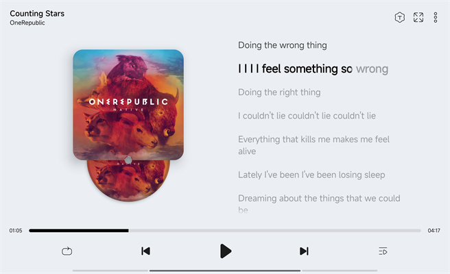

# 简介
LeapMusic是一款漂亮的本地音乐播放器，支持全球38种语言。
#### `免费无广告` `简洁不臃肿` `流畅体验` `功能强大`

# 预览图
\
支持`平板设备`，支持`深色/浅色模式`

# 下载
\
系统版本：Android7.0+\
软件大小：约9MB\
软件无联网功能，不会上传您的数据。

#### [点击这里下载](https://github.com/xtdf/LeapMusic/releases)

 

# 软件特点
* __全局动画__：启动动画，组件动画，歌词动画，流畅体验
* __全局主题__：精准提取专辑颜色，全局使用，沉浸体验
* __逐字歌词__：支持制作和显示逐字歌词
* __音乐可视化__：支持跟随音乐节奏显示音频频谱
* __全屏动态歌词__：支持歌词模糊和延迟跳动动画
* __倍速/音调/均衡器__：支持调节音乐播放参数
* __标签编辑__：支持快捷编辑和更新音乐标签
* __全局模糊菜单背景__：支持全局模糊功能

 

# 关于软件
欢迎反馈软件问题/翻译问题等：\
leapmusic@outlook.com

<!-- #####感谢大家的鼓励，感谢你们的陪伴！❤️ -->